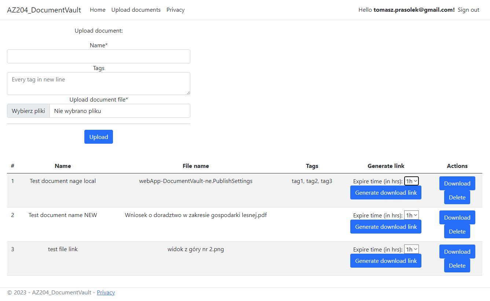
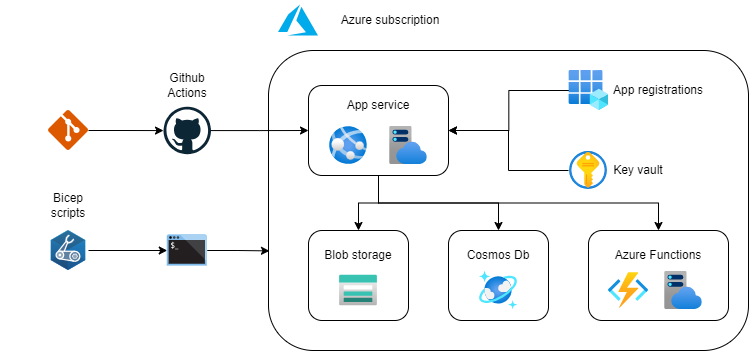

# AZ204-DocumentVault

Azure Document Vault with Expiry &amp; CDN Integration

> Project created in purpose to learn some things needed to pass AZ-204 exam. 

## App

I created the ASP.NET Core Web application (Razor Pages). This very very simple files storage like OneDrive.

### Features:

- Authorization: only logged in user can use it. Only users from my domain: `tomaszprasolekgmail.onmicrosoft.com` can log in.
- Add files with name and tags.
- See the list of all your files.
- Download the files.
- Delete the files.
- Generate download link to the files. User must select an expiration time for it: 1/2/4 or 8 hours.
  - That link can be send to someone else to download it. That other person does not must to have the account in this app.

> **Note:** The UI is very simple and minimalistic :-) I want to point out that I am not the frontend developer, I had little experience with HTML and CSS more then 10 years ago.



## Technologies used

- **ASP.NET Core Web application (Razor Pages).** - web application
- **Azure App Service** - hosting for web application
- **Azure Storage** - stores the uploaded files
- **Azure Key Vault** - stores the secrets
- **Cosmos Db** - stores files data and metadata
- **App registraion** - to be able to log in using Azure credentials (OpenId Connect)
- **Azure Function** (HTTP trigger) to generate download link for blob
- **GitHub Actions** to do deploy web application and Azure Function to the Azure
- **Bicep** scripts - creates all infrastracture in Azure



## How to set up the CI/CD on Github and environment on Azure

### Web App

- Create resource group when all other Azure resource will be placed
- Get your principal identifier from Azure, it is needed for the next script. You can find it: `Users >> your user >> Object Id`.
- Run Azure Bicep script: `main.bicep` (AZ204-DocumentVault/Bicep/main.bicep) and pass `Object Id` as parameter
  - Command to run script: `az deployment group create --resource-group rg-DocumentVault-ne --template-file .\AZ204-DocumentVault\Bicep\main.bicep --parameter parPrincipalId='azure-user-object-id'`. **Remember changing the resource group name and principal id.**
  - The User `Object Id` is needed for... **TODO: add what for is ObjectId needed** 
- After create the resource in Azure, download publish profile from Azure:
  - `Portal Azure >> Resource group >> App service >> Download publish profile`
- Put it in repository secret on Github. Secret name: `AZURE_WEBAPP_PUBLISH_PROFILE`. It is needed to Github Actions, to deploy app to WebApp in Azure.
  - `Github repository >> Settings >> Secrets and variables >> Actions >> AZURE_WEBAPP_PUBLISH_PROFILE`
- Register the app in Azure:
  - Open **App registrations** view in Azure and register new app
    - `App registrations >> New registration`
    - Enter app name
    - Select `Accounts in this organizational directory only (Default Directory only - Single tenant)`
    - Redirect URI >> Web >> Link: `https://webapp-documentvault-ne.azurewebsites.net/signin-oidc`
      - If you want to the app locally you must also add `https://localhost:7289/signin-oidc` URL.
    - Set `ID tokens (used for implicit and hybrid flows)`
      - `App registrations >> AZ204-DocumentVault >> Authentication >> Section: Implicit grant and hybrid flows`
  - Add `Directory (tenant) ID` and `Application (client) ID` to Github project secrets. You can find it on `Overview` page of `AZ204-DocumentVault` registration page
    - `Github repository >> Settings >> Secrets and variables >> Actions`:
      - `CLIENTID` secret
      - `TENANTID` secret
  - Deploy app to Azure using Github Actions
    - `Github repository >> Actions >> Workflows: Deploy to Azure Web App >> Run workflow`

### Azure Function

- [???] CLI - create RBAC credentials [???]
- After deploy the Azure Function, need to copy function URL to Github project secrets:
  - Resource group: `rg-DocumentVault-FunctionApp-ne`
  - Function app: `functionApp-app`
  - Overview tab >> Functions >> click function `GenerateDownloadLink`
  - Click `Get Function URL` on Overview tab
  - Copy function code and paste in in Github project secrets in variable `GENERATEDOWNLOADMETHODFUNCTIONKEY`

## Commands

Deploy Bicep script when create resource group in it:

```
az deployment sub create --location northeurope --template-file .\AZ204-DocumentVault\Bicep\main.bicep
```

Create all needed resources:
```
az deployment group create --resource-group rg-DocumentVault-ne --template-file .\AZ204-DocumentVault\Bicep\main.bicep --parameter parPrincipalId='azure-user-object-id'
```

## Links 

### Azure Cosmos Db

- https://stackoverflow.com/questions/63243857/what-does-upsertitemasync-do-in-the-net-cosmos-db-client
- https://learn.microsoft.com/en-us/azure/cosmos-db/partial-document-update
- https://learn.microsoft.com/en-us/azure/cosmos-db/partial-document-update-getting-started?tabs=dotnet

### Azure Functions

- https://stackoverflow.com/a/55133438
- https://www.voitanos.io/blog/how-to-create-azure-function-apps-with-bicep-step-by-step/
- https://learn.microsoft.com/en-us/azure/azure-functions/functions-create-first-function-bicep?tabs=CLI
- https://www.youtube.com/watch?v=82QnxMp8PRY
- https://learn.microsoft.com/en-us/azure/azure-functions/functions-scale#limitations-for-creating-new-function-apps-in-an-existing-resource-group

#### Github Actions

- https://github.com/Azure/functions-action/issues/147#issuecomment-1251143109

### Others

- https://github.com/AzureAD/microsoft-identity-web/wiki/web-apps
- https://brettmckenzie.net/posts/the-input-content-is-invalid-because-the-required-properties-id-are-missing/
- https://learn.microsoft.com/en-us/troubleshoot/azure/active-directory/error-code-aadsts50011-redirect-uri-mismatch
- https://stackoverflow.com/questions/43914151/azure-functions-i-cannot-choose-consumption-plan

## TODO
- [ ] Remove publishToAzure.run - use `git filter-repo` >> https://gist.github.com/tomaszprasolek/a1d66512bf30afd5019df6b20a2255ab
- [ ] Make pipeline to run Bicep script and create infrastructure in the Azure
- [ ] Add Azure Function, timger trigger - remove expired links from Azure CosmosDb
